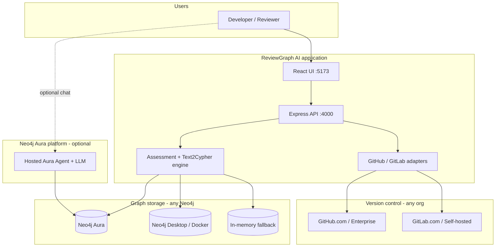
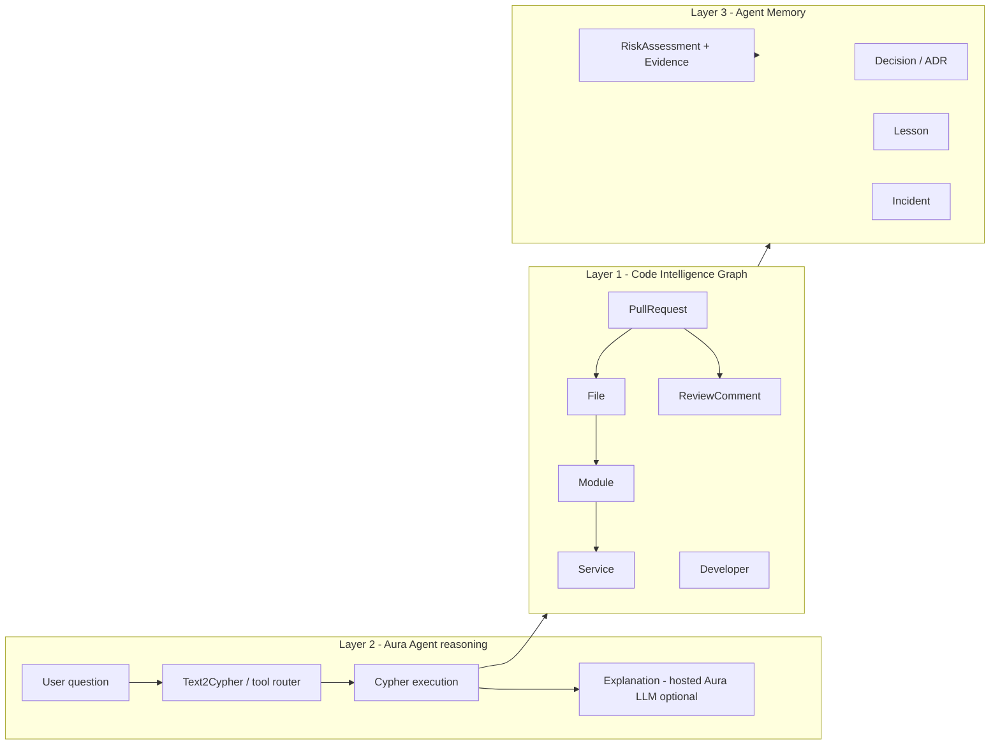
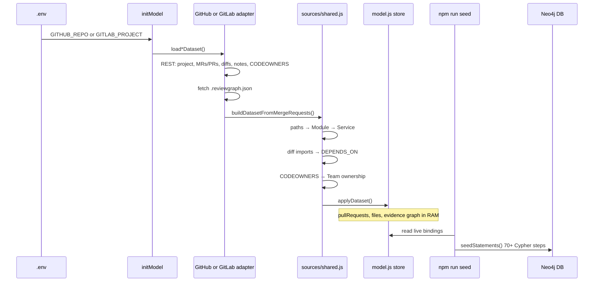
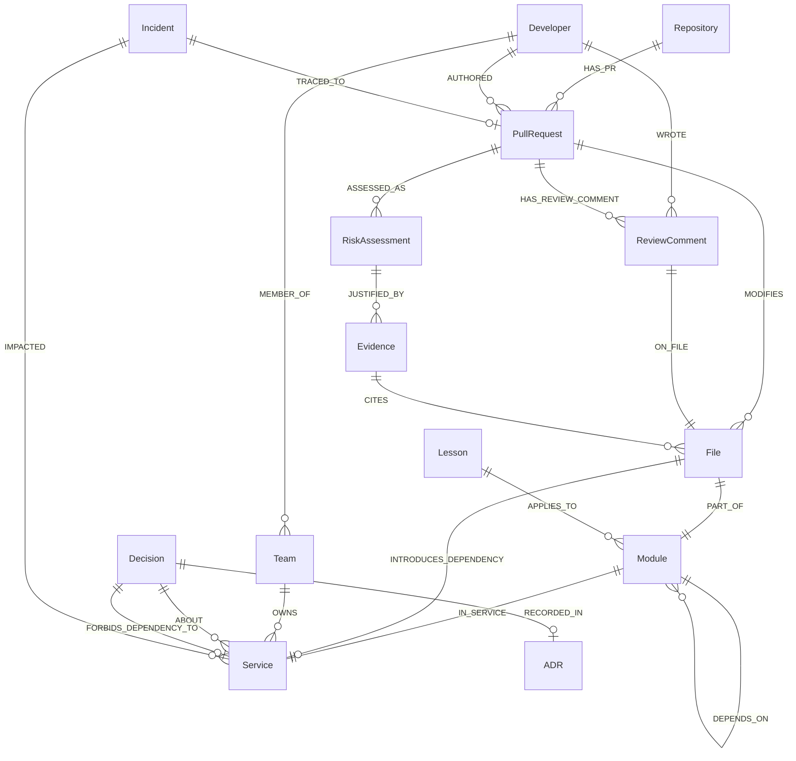
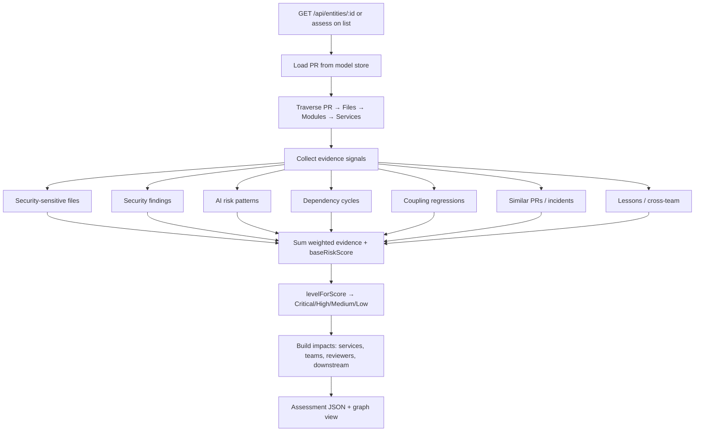
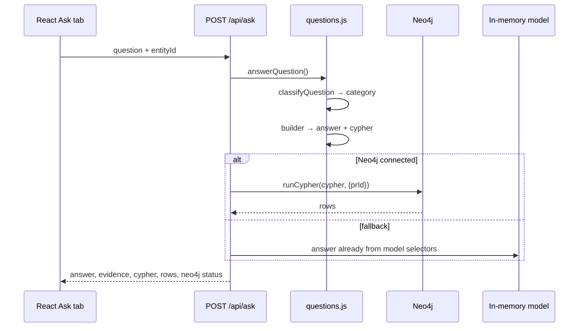
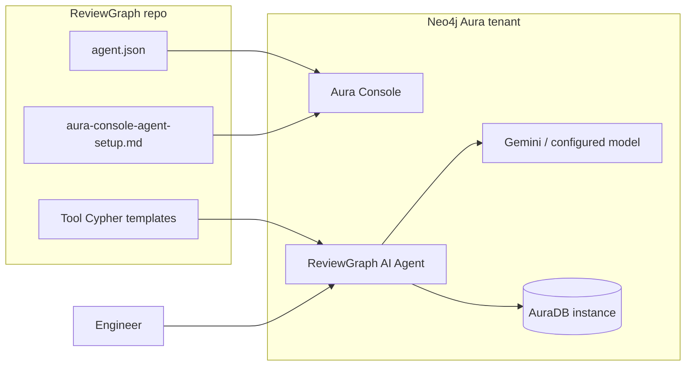
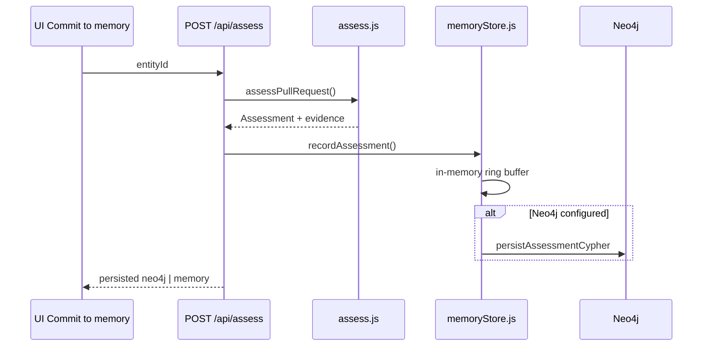

# Technical architecture

ReviewGraph AI is an **Aura-powered engineering intelligence agent** for reviewing AI-written code. It combines a **Code Intelligence Graph** (Neo4j), a **reasoning layer** (Text2Cypher + tools), and **Agent Memory** (persistent assessments and organizational knowledge).

This document is the detailed technical reference. For **where to enter credentials**, see [CONFIGURATION.md](CONFIGURATION.md). For **what is built**, see [IMPLEMENTATION.md](IMPLEMENTATION.md).

---

## 1. System context



**Generic boundaries:**

- **VCS:** GitHub *or* GitLab (same canonical graph after ingest).
- **Neo4j:** Any Bolt endpoint; optional — without it, the engine uses RAM.
- **Aura Agent:** Optional hosted agent on Aura; local app implements the same tools without an external LLM.

---

## 2. Three-layer model



| Layer | Stored as | Purpose |
| --- | --- | --- |
| **L1** | Neo4j nodes/relationships | What changed, who owns it, how code connects |
| **L2** | Stateless logic + `agent.json` | Answer questions with graph-backed reasoning |
| **L3** | Neo4j + in-memory buffer | “Have we seen this before?” — decisions, lessons, committed assessments |

---

## 3. Deployment architecture

```mermaid
flowchart TB
  subgraph env [Configuration .env]
    SRC[SOURCE / GITHUB_* / GITLAB_*]
    NEO[NEO4J_URI / USER / PASSWORD]
    PORT[PORT]
  end

  subgraph startup [Startup sequence]
    Load[loadDomainPack]
    Init[pack.init → initModel]
    GHsrc[sources/github.js]
    GLsrc[sources/gitlab.js]
    Demo[sources/demo.js]
    Apply[applyDataset → model store]
  end

  subgraph runtime [Runtime]
    Listen[Express listen]
    Meta[/api/meta]
    Ask[/api/ask]
    Assess[/api/assess]
  end

  env --> Load
  Load --> Init
  Init -->|SOURCE=github| GHsrc
  Init -->|SOURCE=gitlab| GLsrc
  Init -->|SOURCE=demo| Demo
  GHsrc --> Apply
  GLsrc --> Apply
  Demo --> Apply
  Apply --> Listen
  Listen --> Meta
  Listen --> Ask
  Listen --> Assess
  NEO --> Ask
  NEO --> Assess
```

**Entry point:** `server/index.js` loads `domains/codereview/pack.js`, calls `pack.init()`, then serves the API.

---

## 4. Data ingestion pipeline



### Canonical merge request shape (VCS-agnostic)

Both adapters produce the same structure before `buildDatasetFromMergeRequests()`:

| Field | GitHub source | GitLab source |
| --- | --- | --- |
| `iid` | PR `number` | MR `iid` |
| `files[].patch` | `pulls/{n}/files` | `merge_requests/{iid}/changes` |
| `comments` | Review comments on path | MR notes with `position.new_path` |
| `reviewerLogins` | Submitted reviews | Note authors |
| Ownership | CODEOWNERS file | CODEOWNERS / `.gitlab/CODEOWNERS` |

---

## 5. Graph schema (Layer 1 + 3)



Authoritative labels: [`domains/codereview/schema.js`](../domains/codereview/schema.js).

---

## 6. Assessment flow (explainable risk)



**Rule:** no verdict without evidence — every score cites graph nodes (`cite()` in `server/domain/contract.js`).

Implementation: [`domains/codereview/assess.js`](../domains/codereview/assess.js).

---

## 7. Ask the Graph (Layer 2 — local Aura Agent)



### Question categories → tools

| Category | Example question | Aura tool name |
| --- | --- | --- |
| `risk` | Why is this PR risky? | `explain_pr_risk` |
| `reviewers` | Who should review this PR? | `recommend_reviewers` |
| `propagation` | What could break if this merges? | `risk_propagation` |
| `compliance` | Does this violate our architecture? | `architecture_compliance` |
| `incidents` | Has this caused problems before? | `related_incidents` |
| `impact` | What is the impact? | `change_impact` |
| `coupling` | Which modules are tightly coupled? | `tightly_coupled_modules` |
| *open* | Any other NL question | `reviewgraph_text2cypher` |

Agent definition: [`domains/codereview/agent.json`](../domains/codereview/agent.json).

---

## 8. Aura Agent integration (hosted)



**Steps:**

1. Configure `.env` Neo4j credentials → `npm run seed`.
2. In Aura Console: create agent from prompt; add tools from `agent.json`.
3. Enable GenAI + tool authentication ([checklist](aura-console-agent-setup.md)).
4. Chat in Aura UI or invoke via Agents API / MCP.

The **local app** does not require the hosted agent to function; it implements the same graph queries directly.

---

## 9. Agent memory write path



---

## 10. Component map

| Path | Responsibility |
| --- | --- |
| `server/index.js` | HTTP API, orchestration |
| `server/neo4j.js` | Bolt driver (any Neo4j) |
| `server/memoryStore.js` | Layer 3 assessment persistence |
| `server/domain/loader.js` | Load `domains/codereview/pack.js` |
| `domains/codereview/pack.js` | Pack contract + `init()` |
| `domains/codereview/model.js` | Pluggable graph store + selectors |
| `domains/codereview/sources/github.js` | GitHub ingest |
| `domains/codereview/sources/gitlab.js` | GitLab ingest |
| `domains/codereview/sources/shared.js` | VCS → canonical dataset |
| `domains/codereview/sources/demo.js` | Synthetic demo org |
| `domains/codereview/assess.js` | Explainable risk engine |
| `domains/codereview/questions.js` | Text2Cypher routing |
| `domains/codereview/present.js` | UI list + graph canvas |
| `domains/codereview/seedStatements.js` | Neo4j seed |
| `domains/codereview/agent.json` | Aura Agent tools (as code) |
| `src/main.jsx` | React UI |
| `decks/build.js` | Presentation generator |

---

## 11. Security notes

- Store **tokens and Neo4j passwords** only in `.env` (never commit `.env`).
- GitLab uses `PRIVATE-TOKEN`; GitHub uses `Bearer` token.
- Private repos require tokens with read access to merge requests and repository content.
- Aura tool authentication is configured in Aura Console per instance.

---

## Related documents

- [CONFIGURATION.md](CONFIGURATION.md) — all credentials and entry points
- [IMPLEMENTATION.md](IMPLEMENTATION.md) — feature checklist
- [adr/README.md](adr/README.md) — architecture decision records
- [GETTING_STARTED.md](GETTING_STARTED.md) — tutorials
- [product-context.md](product-context.md) — product vision
